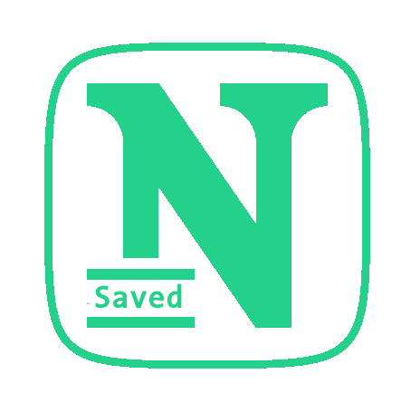

<p align="center"><a href="" target="_blank" rel="noopener noreferrer"></a></p>

<p align="center">
  <a href="https://github.com/AM-77/savednotes/blob/master/LICENSE">
  
  </a>
  <a href="savednotes.vercel.app/" alt="Website" ></a>
  
</p>

<h2 align="center">savednotes</h2>
<p align="center">Save & Share note.</p>

## Built with:

- [MySQL](https://www.mysql.com/)
- [ExpressJs](http://expressjs.com/)
- [ReactJs](https://reactjs.org)
- [NodeJs](https://reactjs.org/)


## Developement:

- clone the repo:

```bash
  git clone https://github.com/AM-77/savednotes
```

- run the server:

    **inside the server folder:**
    - install dependencies :

        ```bash
        npm install
        ```
    
    - run the test:

        ```bash
        npm test
        ```

    - run the server:

        ```bash
        npm start
        ```
        The server should be running in `http://localhost:3300`

- run the client :

    **inside the client folder:**

    - install dependencies :

        ```bash
        npm install
        ```

    - run the test:

        ```bash
        npm test
        ```

    - start the app:

        ```bash
        npm start
        ```
        The react app should be running in `http://localhost:3000`

- happy hacking 👨‍💻

## Contribtion:

Feel free to open a pull requset 💁, report a bug 🐛 or request a feature 🌟 anytime you want.

## License & copyright:

© AM-77
Licensed under the [MIT License](LICENSE).
